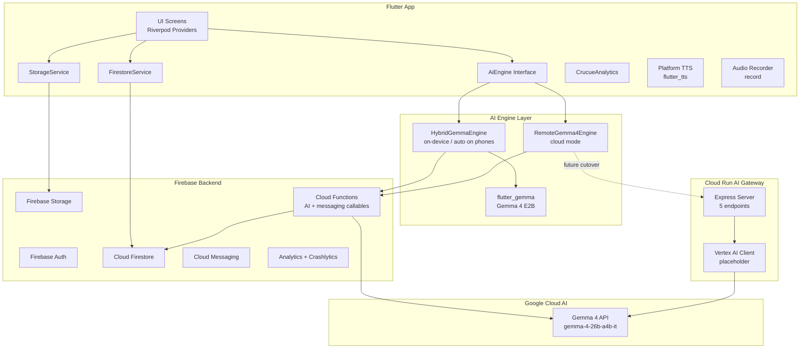
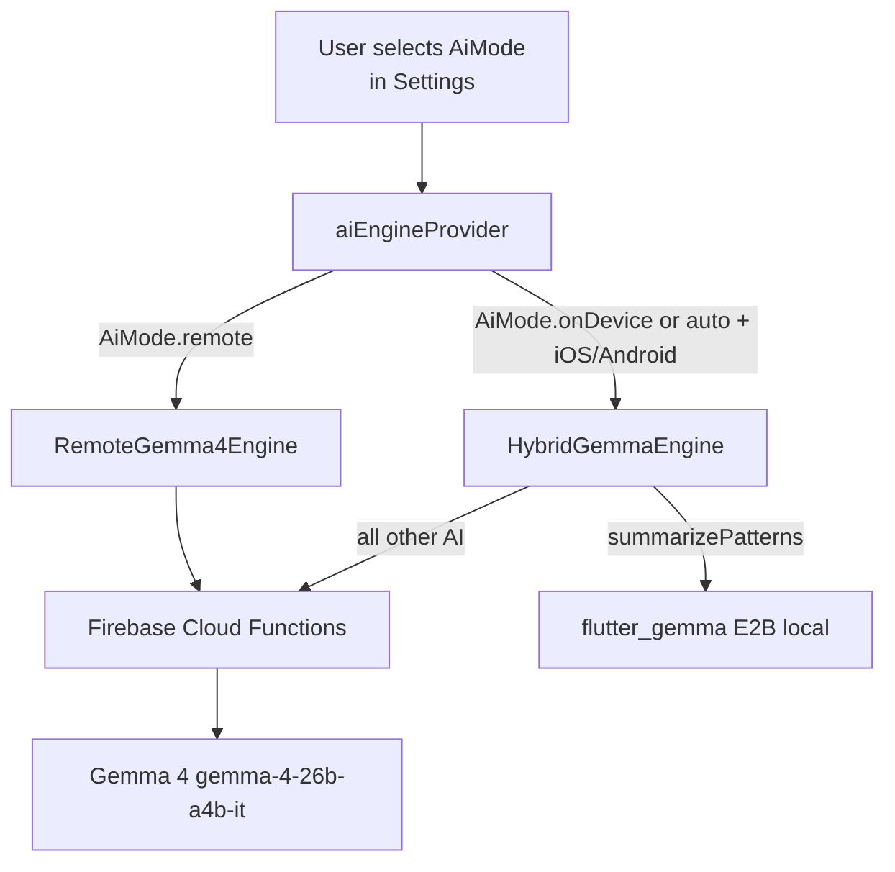
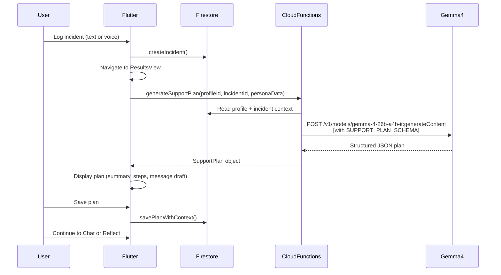
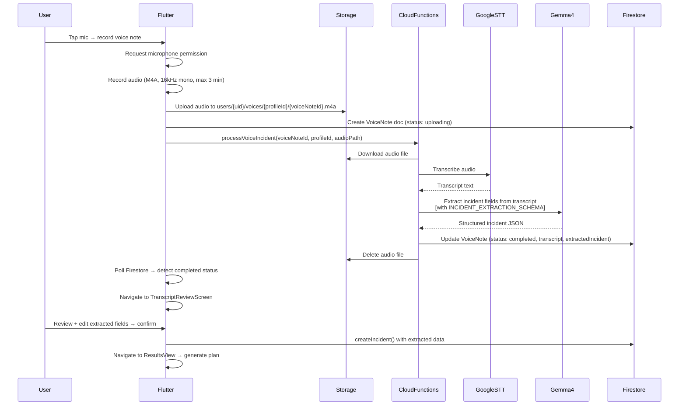

# Crucue Production Architecture

## Overview

Crucue is a Flutter mobile app with a Firebase backend. AI inference runs through a server-side abstraction layer that currently uses Firebase Cloud Functions and is designed to cut over to a Cloud Run AI Gateway without changes to the Flutter app.

The architecture is hybrid-first: cloud by default, on-device on supported hardware, with a consistent `AiEngine` interface that keeps the Flutter code agnostic to where inference runs.

---

## System architecture

---

## Current state vs target

| Component | Current state | Target |
|-----------|--------------|--------|
| AI inference (remote) | Cloud Functions → Google GenAI API (Gemma 4, key in Secret Manager) | Optional: Cloud Run Gateway → Vertex AI for HTTP routes |
| AI inference (on-device) | `HybridGemmaEngine` + community `flutter_gemma`: weekly insights when Gemma 4 E2B weights downloaded | Optional: more local surfaces after eval; not 26B on phone |
| Navigation | GoRouter (`MaterialApp.router`) + shared `navigatorKey` + `navigateTo()` | Gradual migration to `context.go` / named routes |
| AI routine suggestion | Callable `suggestRoutineFromReflection` (same stack as other AI callables) | Optional duplicate: gateway `POST /api/v1/suggest-routine` (Vertex) |
| App Check | Activated in `main.dart`; callables use `enforceAppCheck: true` | Production attestation providers in Firebase Console |
| FCM | Tokens under `users/{uid}/devices/{id}`; `sendTestPushNotification` callable | Product-specific campaigns / triggers |

---

## Flutter app responsibilities

The Flutter app:
- Owns all UI and user interaction
- Reads and writes Firestore via `FirestoreService` (never directly)
- Routes all AI calls through `aiEngineProvider` → `AiEngine` interface
- Manages AI mode preference (`AiMode` enum) via `AiModeNotifier` with `SharedPreferences` persistence
- Handles voice recording lifecycle (permission, record, upload, poll status, review)
- Drives TTS playback via `PlatformTtsService` (platform-native, no API cost)
- Reports errors to Crashlytics and events to Analytics via typed helpers
- Never holds an AI API key

### Firebase AI Logic (`firebase_ai`)

Google’s [Firebase AI Logic](https://firebase.google.com/docs/ai-logic/get-started?platform=flutter) Flutter plugin (`firebase_ai`) is the official client path for Gemini-family models when you want Firebase-managed access from the device. Crucue keeps **primary caregiving inference on the server** (Cloud Functions + `@google/genai` + API keys in Secret Manager) to avoid shipping generative keys in the client and to preserve a single validation layer. Adopting `firebase_ai` remains an option for **future, scoped** features if product and security review justify client-side calls.

---

## AI engine selection

The `AiEngine` interface (`lib/core/ai/ai_engine.dart`) defines 6 methods:
- `generateSupportPlan`
- `chatOnPlan`
- `summarizePatterns`
- `suggestRoutineFromReflection` (Cloud Function → GenAI; on-device mode still uses this callable for routine suggestion until local models support it)
- `processVoiceIncident`
- `transcribeShortClip`

---

## Incident-to-plan flow

---

## Voice incident flow

---

## Firebase backend responsibilities

| Service | Usage |
|---------|-------|
| Auth | Email/password + Google Sign-In + Apple. Token verified in Cloud Functions via `request.auth`. |
| Firestore | All structured data under `users/{uid}/...`. Security rules enforce owner-only access. |
| Storage | Voice audio (temporary) + profile avatars. Audio deleted after successful transcription. |
| Cloud Functions | AI callables + `sendTestPushNotification`. API keys held server-side. Auth + App Check enforced on callables. |
| FCM | Tokens stored per installation under `users/{uid}/devices/{installationId}`. Test send via callable. |
| App Check | Flutter `firebase_app_check`; Play Integrity / App Attest (debug providers in dev). |
| Analytics | Event tracking via `CrucueAnalytics` typed helpers. |
| Crashlytics | Full async error coverage. Fatal + non-fatal. |

---

## Vertex AI vs Google GenAI API (product decision)

**Current decision (Crucue):** Cloud Functions keep the **Google GenAI API** (`@google/genai` + `GEMMA4_API_KEY` in Firebase Secret Manager). This matches a fast bootstrap, minimal GCP IAM surface, and the [Gemini API vs Vertex comparison](https://cloud.google.com/vertex-ai/generative-ai/docs/migrate/migrate-google-ai) row for “API key auth” and standard developer terms.

**When to revisit Vertex:** If you need enterprise SLAs, HIPAA/SOC2-style positioning, regional endpoints, VPC, provisioned throughput, or Google Cloud commit/billing alignment—migrate callables to **Vertex-backed** `@google/genai` (`vertexai: true`, service account) per the same migration guide. Gemma 4 remains available on both paths; validate model IDs and **regions** before switching.

- **Cloud Functions (primary):** `@google/genai` + API key → Gemma 4 IT (e.g. `gemma-4-26b-a4b-it`). Not Vertex.
- **Cloud Run AI Gateway (`backend/ai-gateway/`):** Uses **Vertex AI** (`vertex-client.ts`) for optional HTTP routes. Flutter callables remain the default product path.

## Cloud Run AI Gateway

The `backend/ai-gateway/` directory contains an Express/TypeScript service. It is **optional** and **not required** for the shipped app path — Cloud Functions are the active backend for Flutter callables.

**Gateway endpoints:**
- `POST /api/v1/generate-plan`
- `POST /api/v1/chat`
- `POST /api/v1/extract-incident`
- `POST /api/v1/summarize-patterns`
- `POST /api/v1/suggest-routine`

**Gateway features:**
- Firebase Auth token verification (every request)
- AJV JSON Schema validation (request bodies and AI outputs)
- Structured Winston logging (Cloud Logging compatible)
- Rate limiting (60 req/min per IP)
- Persona-policy-aware prompt building
- Schema-validated structured output with graceful partial fallback
- Ready for `gcloud run deploy`

**Deploy:** Configure project, region, and IAM; containerize and deploy to Cloud Run when you want Vertex-backed HTTP APIs alongside callables.

---

## Structured output schemas

Every AI call uses a JSON response schema. Gemma 4 is instructed to return JSON only; the server validates and parses it.

| Operation | Schema | Key fields |
|-----------|--------|-----------|
| Support plan | `SUPPORT_PLAN_SCHEMA` | `summary`, `steps[]`, `messageDraft`, `safetyNote`, `followUpQuestions` |
| Incident extraction | `INCIDENT_EXTRACTION_SCHEMA` | `whatHappened`, `possibleTrigger`, `whatWasAlreadyTried`, `desiredOutcome`, `safetyFlag`, `confidenceScore` |
| Chat response | `CHAT_RESPONSE_SCHEMA` | `message`, `suggestedFollowUps`, `safetyFlag` |
| Weekly insight | `INSIGHT_SUMMARY_SCHEMA` | `summary`, `patterns[]`, `whatWorked[]`, `suggestions[]`, `moodTrend` |
| Routine suggestion | `ROUTINE_SUGGESTION_SCHEMA` | `title`, `steps[]`, `frequency`, `estimatedDurationMinutes`, `tags[]`, `rationale` |

---

## On-device architecture

See [`on_device_strategy.md`](on_device_strategy.md), [`on_device_and_offline.md`](on_device_and_offline.md), and `lib/core/ai/on_device_model_config.dart`.

**Shipped path:** [`flutter_gemma`](https://pub.dev/packages/flutter_gemma) (community plugin) downloads **Gemma 4 E2B IT** `.litertlm` from Hugging Face; `HybridGemmaEngine` uses it for `summarizePatterns` only. All other `AiEngine` methods still hit Cloud Functions.

**Legacy native channel** (`lib/core/ai/native/on_device_channel.dart` + Android/iOS plugin stubs): not wired into `aiEngineProvider`; kept for optional future native integration.
